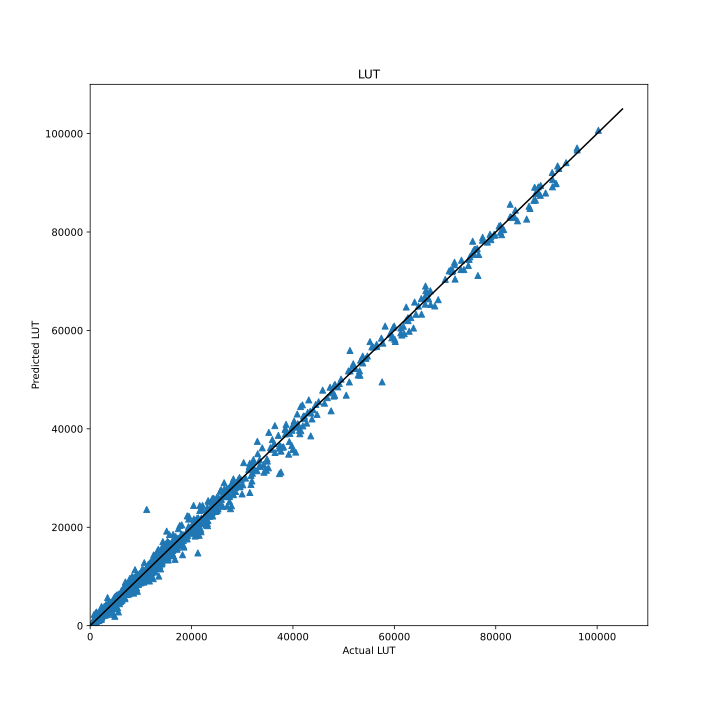
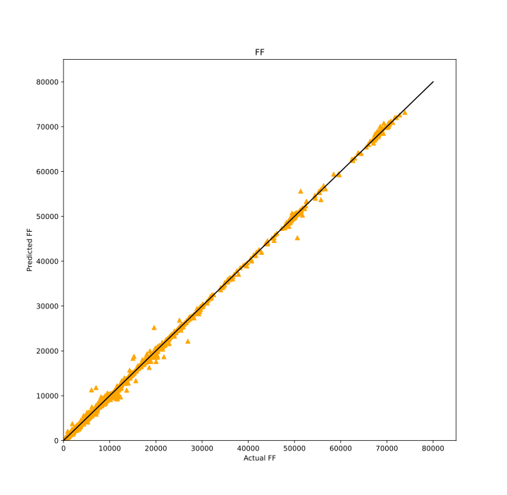
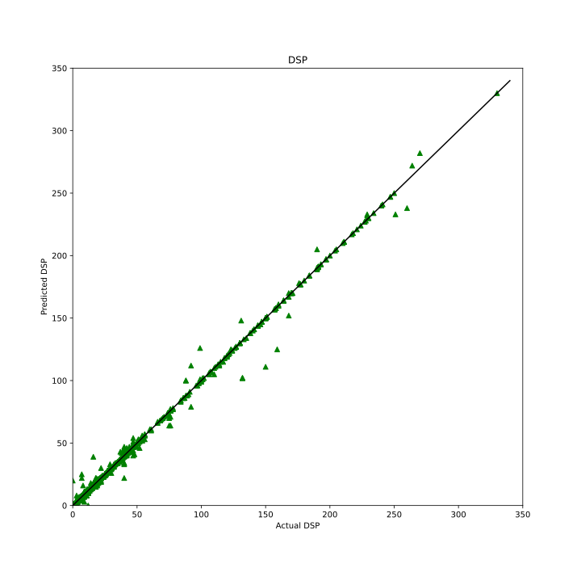
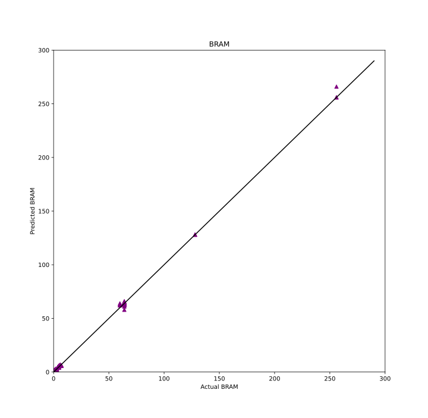
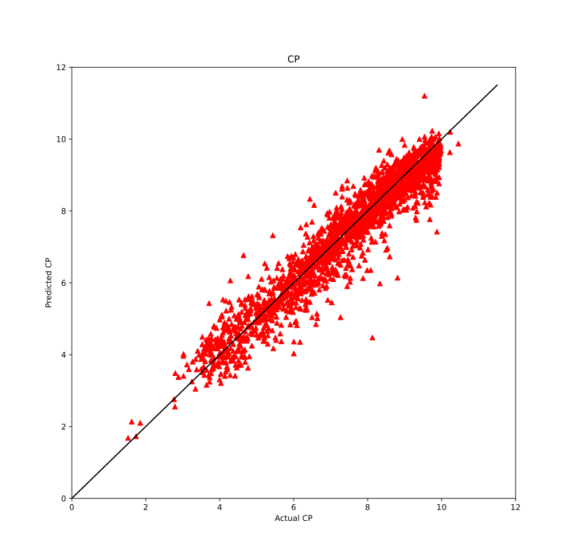
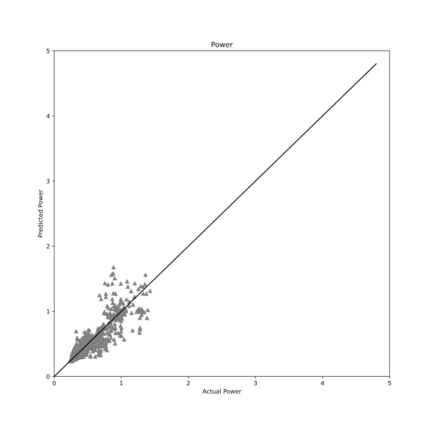

# HGBO-DSE Framework

<figure>

<figcaption align="left">
The proposed HGBO-DSE is an automatic framework composed of HGP, BOME and TDM 
to support fast and efficient multi-objective design space exploration for HLS.
</figcaption>
</figure>

## Prerequisites
### Python Environmant
- python 3.9
- torch 1.13.1
- torch-geometric 2.3.1
- torch-scatter 2.1.1
- torch-sparse 0.6.17
- optuna 3.2.0
- pyDOE 0.3.8
### Vitis Environment
- Vitis HLS 2022.1
- Vivado 2022.1

## Dataset Generator
### Public HLS Dataset
The raw HLS dataset is already generated, which is stored in path "./dataset/raw/". 
Users can access this dataset conveniently to extract features of their interests to fit their own ML models.
### Collect New Samples
If you want to collect new samples (take benchmark 'bfs' as an example), run the following commands:
1. cd bome
2. python3 hls_dse.py --case bfs --ver bulk --alg random

The newly generated samples will be stored in path "./dse_ds/MachSuite/random_ds/".

## Graph Constructor
To generate 'pt' files which store CDFGs for HGP training and testing, run the following commands:
1. cd hgp/data_process
2. python3 gen_dataset_std.py

We already generate 'pt' files in path "./dataset/std/" and "./dataset/rdc/".

## HGP
### Training
HGP is trained for LUT/FF/DSP/BRAM/CP/Power prediction.
The well-trained models are in path "./hgp/model/".

If you want to retrain HGP, run commands:
1. cd hgp
2. python3 hier_lut_model.py

### Inference
The well-trained HGP models call the model parameters ('pt' files in "./hgp/model/") to run inference.

### HGP Prediction Visualization
The following figures visualize the predicted values of HGP in terms of LUT, FF, DSP, BRAM, CP and Power.

<figure class="half">
    
    
</figure>

<figure class="half">
    
    
</figure>

<figure class="half">
    
    
</figure>

## TDM
### Design Space Configuration
- config.yaml (specify which directives to explore)
- params.yaml (specify the options of directives)

We provide the corresponding yaml files for MachSuite benchmarks used in our paper.
For new benchmarks, users can write yaml files based on the rules described in our paper.

### TDM Modeling
TDM is integrated in BOME (in path "./bome/tdm/"). It reads the above yaml files to construct the design space in tree-structure and stores it 
in a dictionary which is then passed to BOME.

## BOME
### Directive Encoding
- Float encoding
- Discrete encoding

BOME supports both of the encoding styles, which can be specified by "--encode [options: float, discrete]"

### PPA Evaluation
- HGP inference flow
- FPGA implementation flow

Specify "--mode [options: hgp, impl]" to choose the PPA evaluation flow.

### DSE Algorithms
Our algorithms:
- MOTPE-D
- MOTPE-F
- MOTPE-FL

Meta-Heuristics for comparison:
- Simulated Annealing (SA)
- Multi-Objective Genetic Algorithm (NSGA-II)

Specify "--alg [options: motpe_d, motpe_f, motpe_fl, nsga, sa]" to choose the DSE algorithm.

### Other Arguments
- --bench [options: MachSuite] (The benchmark set)
- --case [options: aes, bfs, fft, ...] (The specific benchmark)
- --ver [options: aes, bulk, strided] (The version of the specified benchmark)
- --num [options: integer values (e.g., 100, 200)] (The number of optimization steps)
- --device [options: the specific FPGA device (e.g., 'xc7vx485tffg1761-2')]
- --clk [options: e.g., 5, 10] (The frequency running on FPGA board)
- --space [options: tree, uniform] (The design space configuration mode)
- --parallel [options: True, False] (Whether run DSE in parallel or not, MySQL is needed if in parallel)
- --process [options: 1, 2, 3, ...] (The current process number)

### Run DSE
1. cd bome
2. source /mnt/sda1/Xilinx/Vitis/2022.1/settings64.sh
3. python3 hls_dse.py

When running the above commands, the default settings are adopted.
You can add the arguments according to your needs.

## Baseline Models
The baseline models for comparison are in path "./baseline/":
- ironman-pro
- pna-r
- powergear
